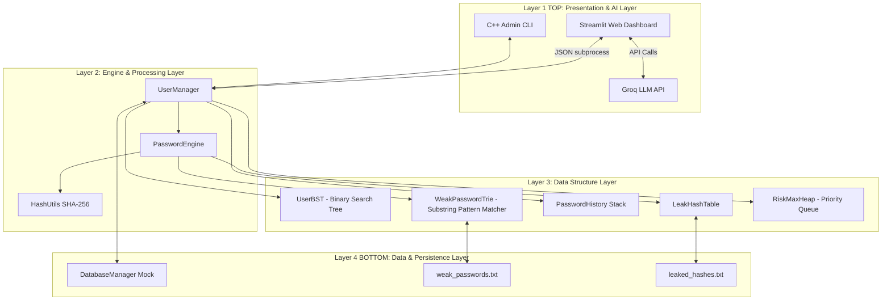

# System Architecture Diagram

```mermaid
flowchart TD
    subgraph Layer1 [Layer 1 TOP: Presentation & AI Layer]
        GUI[Streamlit Web Dashboard]
        AI[Groq LLM API]
        CLI[C++ Admin CLI]
    end

    subgraph Layer2 [Layer 2: Engine & Processing Layer]
        UM[UserManager]
        PE[PasswordEngine]
        HU[HashUtils SHA-256]
    end

    subgraph Layer3 [Layer 3: Data Structure Layer]
        BST[UserBST - Binary Search Tree]
        HT[LeakHashTable]
        ST[PasswordHistory Stack]
        TR[WeakPasswordTrie - Substring Pattern Matcher]
        MH[RiskMaxHeap - Priority Queue]
    end

    subgraph Layer4 [Layer 4 BOTTOM: Data & Persistence Layer]
        DBM[DatabaseManager Mock]
        WF[weak_passwords.txt]
        LF[leaked_hashes.txt]
    end

    GUI <-->|JSON subprocess| UM
    CLI <--> UM
    GUI <-->|API Calls| AI
    
    UM --> PE
    PE --> HU
    
    UM --> BST
    UM --> MH
    PE --> HT
    PE --> TR
    UM --> ST
    
    HT <--> LF
    TR <--> WF
    UM <--> DBM
```
