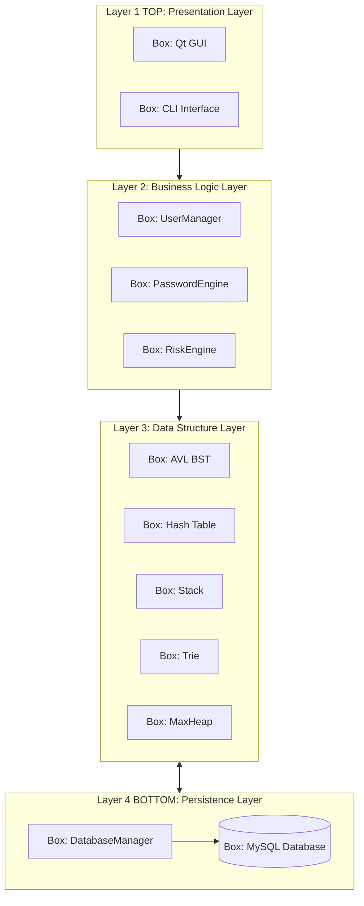

# Architecture Diagram

```mermaid
flowchart TD
    subgraph Layer1 [Layer 1 TOP: Presentation Layer]
        QT[Box: Qt GUI]
        CLI[Box: CLI Interface]
    end

    subgraph Layer2 [Layer 2: Business Logic Layer]
        UM[Box: UserManager]
        PE[Box: PasswordEngine]
        RE[Box: RiskEngine]
    end

    subgraph Layer3 [Layer 3: Data Structure Layer]
        BST[Box: AVL BST]
        HT[Box: Hash Table]
        ST[Box: Stack]
        TR[Box: Trie]
        MH[Box: MaxHeap]
    end

    subgraph Layer4 [Layer 4 BOTTOM: Persistence Layer]
        DBM[Box: DatabaseManager]
        SQL[(Box: MySQL Database)]
    end

    Layer1 --> Layer2
    Layer2 --> Layer3
    Layer3 <--> Layer4
    DBM --> SQL
```
