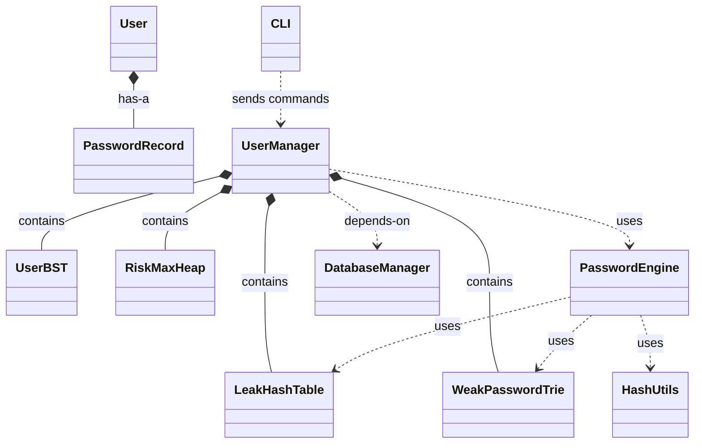

# Class Relationship Diagram

```mermaid
classDiagram
    class User
    class PasswordRecord
    class UserManager
    class UserBST
    class LeakHashTable
    class WeakPasswordTrie
    class RiskMaxHeap
    class PasswordEngine
    class HashUtils
    class DatabaseManager
    class CLI

    User *-- PasswordRecord : has-a
    UserManager *-- UserBST : contains
    UserManager *-- LeakHashTable : contains
    UserManager *-- WeakPasswordTrie : contains
    UserManager *-- RiskMaxHeap : contains
    
    UserManager ..> PasswordEngine : uses
    UserManager ..> DatabaseManager : depends-on
    
    PasswordEngine ..> LeakHashTable : uses
    PasswordEngine ..> WeakPasswordTrie : uses
    PasswordEngine ..> HashUtils : uses
    
    CLI ..> UserManager : sends commands
```
