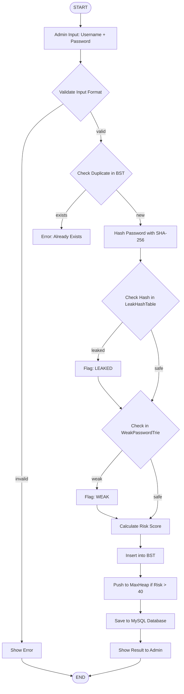

# System Flow Diagram

```mermaid
flowchart TD
    Start([START]) --> Input[Admin Input: Username + Password]
    Input --> Validate{Validate Input Format}
    Validate -- invalid --> ShowError[Show Error]
    ShowError --> End([END])
    Validate -- valid --> CheckDup{Check Duplicate in BST}
    CheckDup -- exists --> DupError[Error: Already Exists]
    CheckDup -- new --> Hash[Hash Password with SHA-256]
    Hash --> CheckLeak{Check Hash in LeakHashTable}
    CheckLeak -- leaked --> FlagLeak[Flag: LEAKED]
    CheckLeak -- safe --> CheckWeak
    FlagLeak --> CheckWeak{Check in WeakPasswordTrie}
    CheckWeak -- weak --> FlagWeak[Flag: WEAK]
    CheckWeak -- safe --> CalcRisk
    FlagWeak --> CalcRisk[Calculate Risk Score]
    CalcRisk --> InsertBST[Insert into BST]
    InsertBST --> PushHeap[Push to MaxHeap if Risk > 40]
    PushHeap --> SaveDB[Save to MySQL Database]
    SaveDB --> ShowResult[Show Result to Admin]
    ShowResult --> End
```
