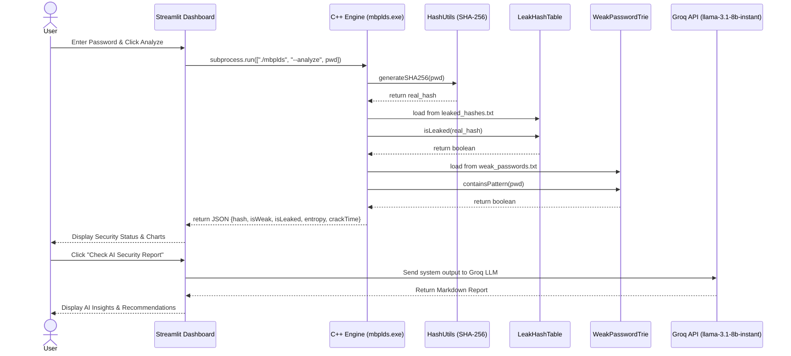

# System Interaction Sequence Diagram

```mermaid
sequenceDiagram
    actor User
    participant GUI as Streamlit Dashboard
    participant CPP as C++ Engine (mbplds.exe)
    participant HU as HashUtils (SHA-256)
    participant HT as LeakHashTable
    participant WT as WeakPasswordTrie
    participant AI as Groq API (llama-3.1-8b-instant)

    User->>GUI: Enter Password & Click Analyze
    GUI->>CPP: subprocess.run(["./mbplds", "--analyze", pwd])
    CPP->>HU: generateSHA256(pwd)
    HU-->>CPP: return real_hash
    CPP->>HT: load from leaked_hashes.txt
    CPP->>HT: isLeaked(real_hash)
    HT-->>CPP: return boolean
    CPP->>WT: load from weak_passwords.txt
    CPP->>WT: containsPattern(pwd)
    WT-->>CPP: return boolean
    CPP-->>GUI: return JSON {hash, isWeak, isLeaked, entropy, crackTime}
    GUI-->>User: Display Security Status & Charts
    
    User->>GUI: Click "Check AI Security Report"
    GUI->>AI: Send system output to Groq LLM
    AI-->>GUI: Return Markdown Report
    GUI-->>User: Display AI Insights & Recommendations
```
