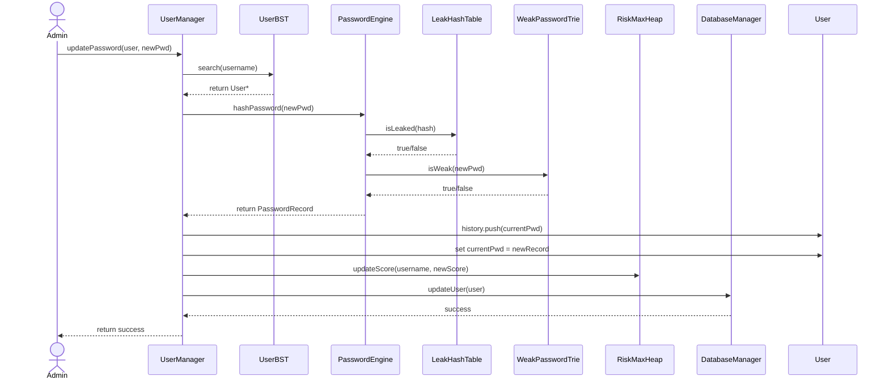

# Password Update Sequence Diagram

```mermaid
sequenceDiagram
    actor Admin
    participant UM as UserManager
    participant BST as UserBST
    participant PE as PasswordEngine
    participant HT as LeakHashTable
    participant WT as WeakPasswordTrie
    participant RMH as RiskMaxHeap
    participant DBM as DatabaseManager

    Admin->>UM: updatePassword(user, newPwd)
    UM->>BST: search(username)
    BST-->>UM: return User*
    UM->>PE: hashPassword(newPwd)
    PE->>HT: isLeaked(hash)
    HT-->>PE: true/false
    PE->>WT: isWeak(newPwd)
    WT-->>PE: true/false
    PE-->>UM: return PasswordRecord
    UM->>User: history.push(currentPwd)
    UM->>User: set currentPwd = newRecord
    UM->>RMH: updateScore(username, newScore)
    UM->>DBM: updateUser(user)
    DBM-->>UM: success
    UM-->>Admin: return success
```
